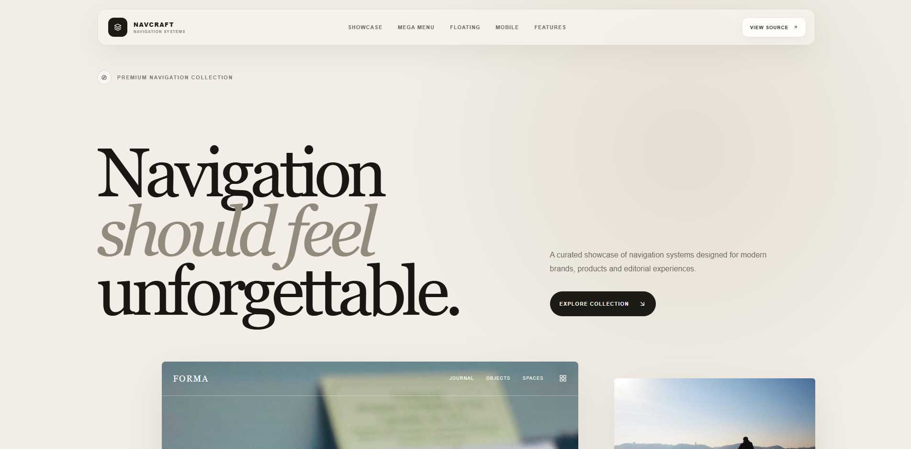

# Premium Navbar UI

A premium React showcase of modern navigation systems, responsive menus, mega menus, floating navbars, and high-end interface patterns.



## Overview

Premium Navbar UI is a curated collection of modern navigation experiences designed to explore how navigation can become a strong visual and interactive part of a digital product.

The project focuses on premium layouts, responsive behavior, layered menus, image-rich navigation, refined interactions, and unique navigation patterns for modern websites and applications.

## Features

- Premium navigation UI patterns
- Responsive desktop and mobile navigation
- Mega menu experiences
- Floating navigation systems
- Image-rich menu layouts
- Smooth hover and interaction states
- Modern responsive behavior
- Modular React components
- Styled-components based architecture
- React Icons integration
- Picsum imagery where suitable
- GitHub Pages deployment

## Tech Stack

- React
- Vite
- JavaScript
- styled-components
- React Icons
- Picsum Photos

## Project Structure

```text
premium-navbar-ui/
├── public/
├── src/
│   ├── components/
│   ├── App.jsx
│   ├── App.styled.js
│   ├── index.css
│   └── main.jsx
├── index.html
├── package.json
├── vite.config.js
├── preview.png
├── LICENSE
└── README.md
```

## Getting Started

Clone the repository:

```bash
git clone https://github.com/a2rp/premium-navbar-ui.git
```

Move into the project directory:

```bash
cd premium-navbar-ui
```

Install dependencies:

```bash
npm install
```

Start the development server:

```bash
npm run dev
```

## Production Build

Create an optimized production build:

```bash
npm run build
```

Preview the production build locally:

```bash
npm run preview
```

## Deployment

The project is configured for deployment on GitHub Pages.

The Vite base path is:

```js
base: "/premium-navbar-ui/";
```

Deploy the latest production build:

```bash
npm run deploy
```

## Navigation Concepts

The project is designed to explore multiple navigation patterns, including:

- Glass navigation
- Editorial navigation
- Floating navigation
- Mega menus
- Image-rich dropdowns
- Minimal luxury navigation
- Mobile drawer navigation
- Fullscreen navigation
- Sticky navigation
- Scroll-reactive navigation
- Adaptive navigation systems

## Design Direction

The interface combines modern product design with editorial and luxury-inspired visual language.

The focus is on:

- Strong hierarchy
- Refined spacing
- Premium typography
- Layered depth
- Subtle motion
- High-quality imagery
- Elegant responsive behavior
- Clear navigation architecture

## Author

**Ashish Ranjan**

Full-Stack Web Developer focused on modern web applications, frontend interfaces, backend systems, creative coding, and experimental technology.

## Connect With Me

- [Portfolio](https://www.ashishranjan.net)
- [GitHub](https://github.com/a2rp)
- [CodePen](https://codepen.io/ash1198)
- [LinkedIn](https://www.linkedin.com/in/aashishranjan)
- [Facebook](https://www.facebook.com/theash.ashish/)
- [YouTube](https://www.youtube.com/@ashishranjan-ashz?sub_confirmation=1)
- [Buy Me A Coffee](https://buymeacoffee.com/a2rp)
- [Patreon](https://patreon.com/a2rp)
- [Email](mailto:ash.ranjan09@gmail.com)

## Support

If you like my work and want to support future projects:

[Support My Work](https://a2rp-donation-page.netlify.app/)

## License

This project is licensed under the MIT License.

---

Made with ❤️ by [Ashish Ranjan](https://www.ashishranjan.net)
